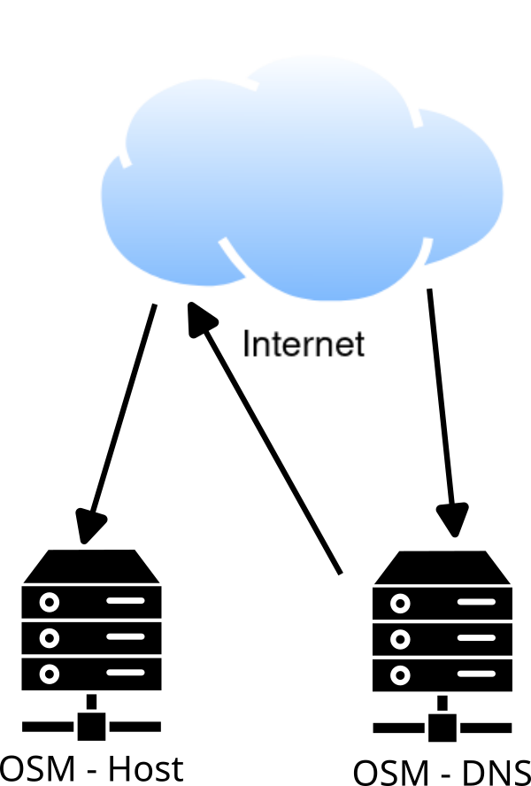
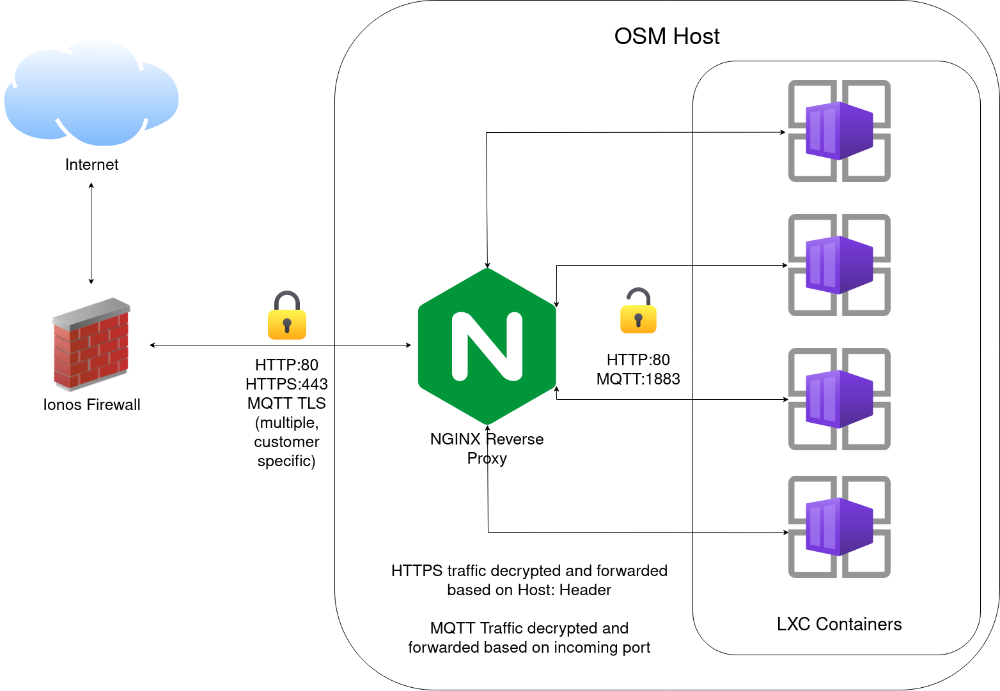

---
  <style>
    body {
      font-family: sans-serif;
    }
  </style>
---
# Devtank Open Smart Monitor Hosting

## Overview

Devtank manages OpenSmartMonitor infrastructure, which allows customers to view their collected monitoring data.
The overall process of collecting and viewing data is as follows:

1. Data is sent from an OpenSmartMonitor to it's local LoraWAN gateway
2. The data is encrypted with TLS and sent from the gateway to a port on OSM server, unique to the customer
3. NGINX, listening on the port, will remove the TLS layer and forward the traffic to a mosquitto server running inside the respective customer's container
4. Within the container, chirpstack will use mosquitto to subscribe to OSM call-ins. Once chirpstack receives data, it processes it and inserts the data into an InfluxDB2 database.
5. The Grafana instance can then graph this data using the local InfluxDB database. The customer can access Grafana via the aforementioned NGINX server, using [Name-based virtual hosting](https://en.wikipedia.org/wiki/Virtual_hosting#Name-based).

Behind the scenes, different OpenSmartMonitor customers containers are running on different servers.
The domains of the address of the OpenSmartMonitor customers is handled by a Devtank DNS server.
This will return the right server for the customer.

Each customer container may multiple domains to access different services.
Generally, these are:

- customer.opensmartmonitor.devtank.co.uk
- customer-influx.opensmartmonitor.devtank.co.uk
- customer-chirpstack.opensmartmonitor.devtank.co.uk

Where *customer* is the chosen customer name.
These domains correspond to the Grafana, InfluxDB2 and Chirpstack web interfaces respectively.
The convention is to use a dash where a space would naturally be.

So first there is a DNS lookup for which OSM Host the *customer* container is on:
<br>

Then that OSM Host machine for that *customer* is connected to and the connection is sent on to the *customer* container.
<br>


## LXC

### Introduction

The LXC setup on the server uses the lower-level LXC tools.
A *customer* container is an Btrfs subvolume overlay on a common Debian base. (Using OverlayFS).
This reduces resource use and means backups are purely *customer* data and configuration, not a whole OS.

All commands in this tutorial are assumed to be run as root.

To view the running containers, run the following command:
`lxc-ls -f`

### Networking

All containers are running in the same private `10.0.3.0/24` network via the host bridge lxcbr0, defined in `/etc/default/lxc-net`.
Internet access from containers is achieved via NAT.
NGINX uses these internal addresses to pass traffic to the containers.
The addresses are given to the containers via DHCP. LXC spawns a dnsmasq instance using addresses defined in `/etc/lxc/dnsmasq.conf`.
Ansible defines each container's hostname in `/etc/hosts`.
UFW is used on the host for the firewall. Ports must be opened with UFW when defining a new MQTT endpoint etc.

### Container storage and configuration

The `/srv/osm-lxc/lxc` directory contains the OS bases, configurations and container root filesystem layers.
The `os-bases` directory contains directories containing base root filesystems, which can be mounted at the bottom layer on a container rootfs.
The `include` directory contains common configuration files for containers, which can be included. It contains `common.conf`, which is included by all containers.
The `containers` directory contains subdirectories, one for each container. Within these directories, there is a `rootfs-layer` directory - the top-layer data for the container mounted on top of an OS base, `lxc.container.conf` - the LXC config file for the container, and `work`, which is a directory used internally by overlayFS, and can be ignored.

### Controlling LXC

Note: creating and deleting containers is covered in the "Ansible" section.
The LXC containers are not managed by LXC itself. Each container must be explictly instantiated which it's config file.
The script `/opt/devtank/start-containers.sh` will start all containers which are not already running.
This is called at boot with a drop-in config for `lxc.service` defined in `/etc/systemd/system/lxc.service.d/start-containers.conf`.
To stop a container, just run:
`lxc-stop <container>`

### Snapshots
[Snapper](http://snapper.io/) is used to take BTRFS filesystem snapshots of each container's subvolume.
The configurations are stored in `/etc/snapper/configs/`.
Please see the snapper documentation for more information.
To restore a snapshot, the snapshot data can be copied to the container rootfs. USE CAUTION:
`rsync -av --delete /srv/osm-lxc/lxc/containers/<container>/.snapshots/<snap>/snapshot/rootfs-layer/ /srv/osm-lxc/lxc/containers/<container>/rootfs-layer/`

## NGINX

### Configuration

In root_overlay there is a template of `/etc/nginx/nginx.conf` where OSM_HOST_NAME is replaced with the hostname used under the DNS system.
Copy all of `root_overlay/etc/nginx` over the hosting machines `/etc/nginx` and replace the OSM_HOST_NAME in `/etc/nginx/nginx.conf`, but leave the TEMPLATE named files as they are as they as used by the Ansible scripts.

## Ansible

### Introduction
[Ansible](https://en.wikipedia.org/wiki/Ansible_(software)) is used to automatically create, destroy, and provision containers, which includes installing and configuring the software stack.
The ansible files are located at `/srv/osm-lxc/ansible`.
To start, come up with a server name, in this example customer-svr.
This hostname will need to be added to the `hosts` file of the ansible directory.

After a container has been created an provisioned, it will need an nginx config file as explained in [NGINX](#nginx), and a port will need to be opened for the custom MQTT port on the UFW firewall.

### Creating a container

The `create-container.yaml` playbook takes the following options:
| Option             | Description                                                                 |
| ------------------ | --------------------------------------------------------------------------- |
| customer_name      | Used for container name, MQTT username, and other configurations            |
| mqtt_port          | TCP port to use for container MQTT Port                                     |


Example:
`ansible-playbook -i hosts -e 'container_hostname=customer-svr' create-container.yaml`

### Deleting a container

To delete a container with Ansible, the `delete-container.yaml` playbook takes the following options:
| Option             | Description                   |
| ------------------ | ----------------------------- |
| container_hostname | The hostname of the container |

Example:
`ansible-playbook -i hosts -e 'container_hostname=customer-svr' delete-container.yaml`

## Backups

Server backups are hosted on an "osmbackup" container in the Devtank office.
Every night, a cron job defined in `/etc/cron.d/osm-backup` on the OSM server runs an rsync backup to `/srv/backups/lxc/` on the backup server and logs the job to `/var/log/osm-backup`.
Snapper takes snapshots of these backups.


## Guide: Adding a new customer

The following section will explain the steps required to a new customer container.

Before we start, the shell commands in this guide assume you're logged into the OSM server as root with `/srv/osm-lxc/ansible/` as your working directory:
`root@opensmartmonitor:~# cd /srv/osm-lxc/ansible/`

The shell variables below can be modified and applied to your shell in order to execute the commands in this guide:
```sh
CUSTOMER_NAME='customer' # name for customer container
MQTT_PORT='1337' # TCP port for customer container MQTT
```

1. Create the container:
`ansible-playbook -i hosts -e "customer_name=${CUSTOMER_NAME} mqtt_port=${MQTT_PORT}" create-container.yaml`
2. Add credentials into password manager for customer.
3. Test the new instance.

## Possible improvements

- Monitoring and alerting could be improved.
