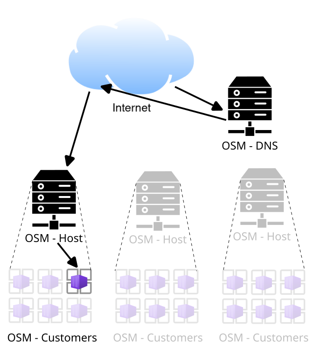

---
  <style>
    body {
      font-family: sans-serif;
    }
  </style>
---
# Devtank Open Smart Monitor Hosting

## Overview

Devtank manages OpenSmartMonitor infrastructure, which allows customers to view their collected monitoring data.
The overall process of collecting and viewing data is as follows:

1. Data is sent from an OpenSmartMonitor to it's local LoraWAN gateway
2. The data is encrypted with TLS and sent from the gateway to a port on OSM server, unique to the customer
3. NGINX, listening on the port, will remove the TLS layer and forward the traffic to a mosquitto server running inside the respective customer's container
4. Within the container, chirpstack will use mosquitto to subscribe to OSM call-ins. Once chirpstack receives data, it processes it and inserts the data into an InfluxDB2 database.
5. The Grafana instance can then graph this data using the local InfluxDB database. The customer can access Grafana via the aforementioned NGINX server, using [Name-based virtual hosting](https://en.wikipedia.org/wiki/Virtual_hosting#Name-based).

Behind the scenes, different OpenSmartMonitor customers containers are running on different servers.
The domains of the address of the OpenSmartMonitor customers is handled by a Devtank DNS server.
This will return the right server for the customer.

Each customer container may multiple domains to access different services.
Generally, these are:

- customer.opensmartmonitor.devtank.co.uk
- customer-influx.opensmartmonitor.devtank.co.uk
- customer-chirpstack.opensmartmonitor.devtank.co.uk

Where *customer* is the chosen customer name.
These domains correspond to the Grafana, InfluxDB2 and Chirpstack web interfaces respectively.
The convention is to use a dash where a space would naturally be.

So first there is a DNS lookup for which OSM Host the *customer* container is on:
<br>

Then that OSM Host machine for that *customer* is connected to and the connection is sent on to the *customer* container.
<br>


## Using Orchestrator

The orchestrator is used in the shell and used from within its folder.
You will need a "config.yaml" file setup for the MySQL of the PDNS and Orchestrator databases.
It is the format:

    {
        "orchestrator":
        {
            "user": "some_user",
            "password": "some_password",
            "host": "some_host",
            "database": "some_db"
        },
        "pdns":
        {
            "user": "some_user",
            "password": "some_password.",
            "host": "some_host",
            "database": "some_db"
        },
        "pdns_domain" : "osmm.some-domain.co.uk",
        "pdns_domain_id" : 1
    }

Once you have the config file in the orchestrator folder, you can see the comands with:

```sh
cd orchestrator
./orchestrator_cli.py
```

### Adding a customer with orchestrator

```sh
cd orchestrator
./orchestrator_cli.py add_customer somecustomer
```

### Removing a customer with orchestrator

```sh
cd orchestrator
./orchestrator_cli.py del_customer somecustomer
```

