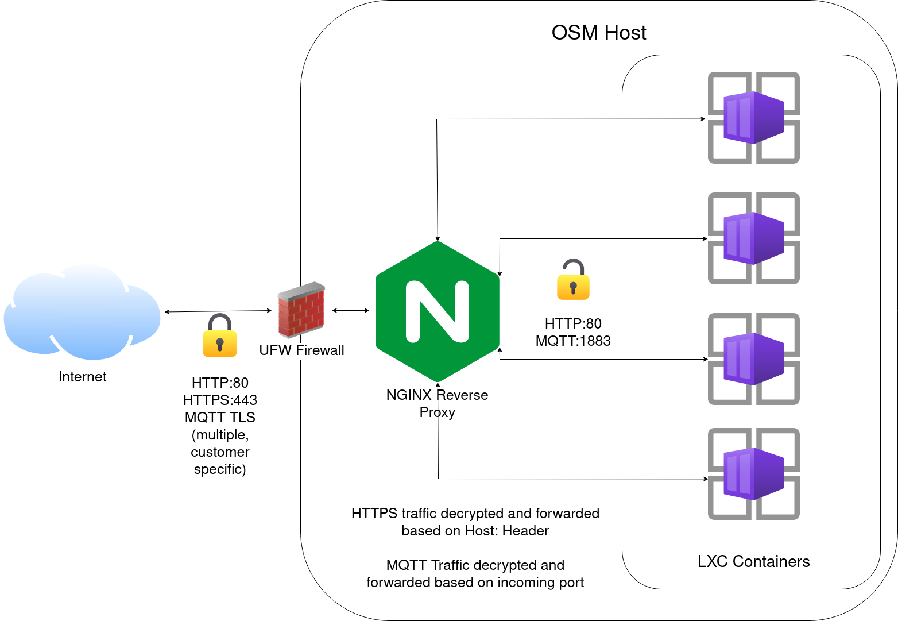

---
  
---
# Devtank Open Smart Monitor Hosting

## Overview

Devtank manages OpenSmartMonitor infrastructure, which allows customers to view their collected monitoring data.  
The overall process of collecting and viewing data is as follows:

1. Data is sent from an OpenSmartMonitor to it's local LoraWAN gateway
2. The data is encrypted with TLS and sent from the gateway to a port on OSM server, unique to the customer
3. NGINX, listening on the port, will remove the TLS layer and forward the traffic to a mosquitto server running inside the respective customer's container
4. Within the container, chirpstack will use mosquitto to subscribe to OSM call-ins. Once chirpstack receives data, it processes it and inserts the data into an InfluxDB2 database.
5. The Grafana instance can then graph this data using the local InfluxDB database. The customer can access Grafana via the aforementioned NGINX server, using [Name-based virtual hosting](https://en.wikipedia.org/wiki/Virtual_hosting#Name-based).

The DNS wildcard **\*.opensmartmonitor.devtank.co.uk** is pointed to the OSM server.  
Each customer gets a few subdomains of opensmartmonitor.devtank.co.uk  
Generally, these are:

- customer.opensmartmonitor.devtank.co.uk
- customer-influx.opensmartmonitor.devtank.co.uk
- customer-chirpstack.opensmartmonitor.devtank.co.uk

Where *customer* is the chosen customer name, like *tiger-assemblies* or *pragmatic*.  
These domains correspond to the Grafana, InfluxDB2 and Chirpstack web interfaces respectively.  
The convention is to use a dash where a space would naturally be.  

## LXC

### Introduction

The LXC setup on the server uses the older, lower-level LXC tools, instead of the newer LXD.  
The reason for this was a layered/overlayFS solution was desired (a [Union mount](https://en.wikipedia.org/wiki/Union_mount)), to keep disk usage to a minimum and ensure container OS/software upgrades could be applied without much duplication.  
This means the data for each customer's container simply consists of a "top layer", on top of a common, shared, debian OS filesystem.  
The result of this requirement has resulted in something rather more... hacky than an LXD solution.  

All commands in this tutorial are assumed to be run as root.  

To view the running containers, run the following command:  
`lxc-ls -f`

### Networking

All containers are running in the same private `10.0.3.0/24` network via the host bridge lxcbr0, defined in `/etc/default/lxc-net`.  
Internet access from containers is achieved via NAT.  
This means the containers can communicate with eachother, as well as the host.  
NGINX uses these internal addresses to pass traffic to the containers.  
The addresses are given to the containers via DHCP. LXC spawns a dnsmasq instance using addresses defined in `/etc/lxc/dnsmasq.conf`.  

### Container storage and configuration

The `/srv/osm-lxc/lxc` directory contains the OS bases, configurations and container root filesystem layers.  
The `os-bases` directory contains directories containing base root filesystems, which can be mounted at the bottom layer on a container rootfs.  
The `include` directory contains common configuration files for containers, which can be included. It contains `common.conf`, which is included by all containers.  
The `containers` directory contains subdirectories, one for each container. Within these directories, there is a `rootfs-layer` directory - the top-layer data for the container mounted on top of an OS base, `lxc.container.conf` - the LXC config file for the container, and `work`, which is a directory used internally by overlayFS, and can be ignored.  

### Controlling LXC

Note: creating, provisioning, and deleting containers is covered in the "Ansible" section.  
The LXC containers are not managed by LXC itself. Each container must be explictly instantiated which it's config file.  
The script `/opt/devtank/start-containers.sh` will start all containers which are not already running.  
This is called at boot with a drop-in config for `lxc.service` defined in `/etc/systemd/system/lxc.service.d/start-containers.conf`.  
To stop a container, just run:  
`lxc-stop <container>`

### Snapshots
WRITE THIS OUT  

## NGINX

### Configuration

All customer/devtank nginx configurations are defined in `/etc/nginx/devtank/`, and are included in `/etc/nginx/nginx.conf`.  
The config directory, is split into two parts, one for `http` and `stream` configurations respectively.  
To create a new configuration for a container within the http or stream directories, copy the `TEMPLATE` file to a new config:  
`cp TEMPLATE customer-svr.conf`  
For HTTP configurations, you will usually only need to change the `CUSTOMERNAME`, which will be the subdomain to use:  
`sed -i s/CUSTOMERNAME/customer/g customer-svr.conf`  
Or edit the file manually for more complex configurations.  
Once NGINX has been configured, reload it to apply the changes:
`nginx -s reload`  

## Possible improvements

- A backup system still needs to be built. **Urgently**.  

Include:

Ansible automation
How LXC works, config files, DHCP /etc/lxc... /etc/default/lxc....
Go thru chat, provide mqtt test scripts etc
Diagrams for how nginx works and is laid out
Nginx tutorial
DNS stuff
idk
